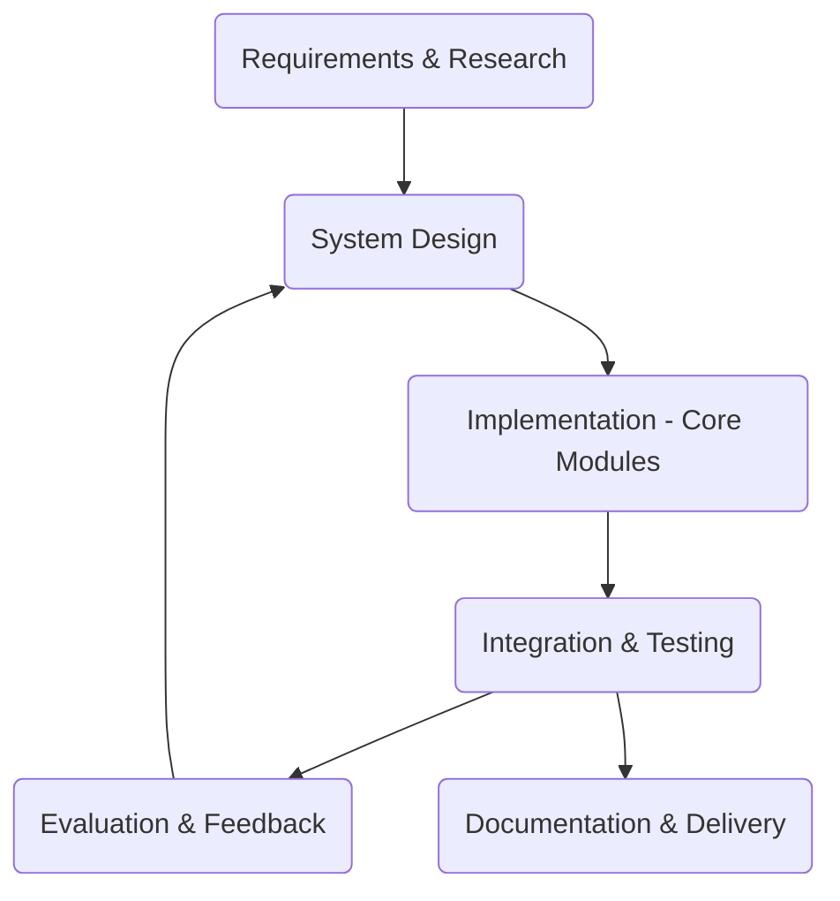
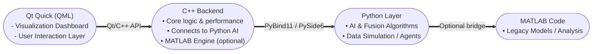

### 1. Topic Title:
## Intelligent Group Decision Support System Simulator Based on Information Fusion and AI Methods

### 2. Abstract:
This project aims to design and implement a prototype Group Decision Support System (GDSS) that integrates multiple information sources using AI-based fusion techniques. The system will simulate multiple decision-making agents, each with independent information inputs and uncertainty levels. The goal is to fuse their opinions into a single, collective decision using probabilistic and AI-driven fusion models. The prototype will provide a visual interface using **Qt Quick** to display the decision process dynamically.

### 2. Abstract

This project aims to design and implement a prototype **Group Decision Support System (GDSS)** that integrates multiple information sources using **AI-based fusion techniques**. The system will simulate multiple decision-making agents, each with independent information inputs and uncertainty levels. The goal is to fuse their opinions into a single, collective decision using probabilistic and AI-driven fusion models.  

The prototype will utilize a **C++ backend** for high-performance computation and seamless integration with **Qt**, while leveraging **Python** for the AI logic and data processing layers. This hybrid architecture ensures both computational efficiency and flexibility in model experimentation. The **Qt framework** allows for smooth interoperability between C++ and Python modules, enabling advanced visualization and interaction features.  

A **visual dashboard** will be implemented using **Qt Quick (QML)** to dynamically represent agents, decision fusion processes, and collective outcomes in real time. QML provides a highly responsive and GPU-accelerated interface, ideal for AI-driven simulations and multi-agent visualization.  

---

>### 2. Abstract

This project designs and implements a prototype **Group Decision Support System (GDSS)** that integrates multiple information sources using **AI-based fusion techniques**. It simulates multiple agents with uncertain inputs and fuses their opinions into a collective decision via probabilistic and AI-driven fusion models.

A **C++ backend** ensures computational efficiency, while **Python** handles AI logic and data processing. The **Qt framework** connects both languages smoothly, supporting high-speed operations and real-time visualization. The **Qt Quick (QML)** dashboard will display agent interactions and fusion outcomes dynamically.

---
	
### 💡 Why Qt Quick
 >**Qt Quick (QML)** offers the best mix of **speed, flexibility, and integration** for this simulator.  
> - **Performance:** GPU-accelerated for smooth real-time visualization.  
>- **Integration:** Connects directly with **C++** and **Python (PySide6/PyQt)** modules.  
>- **Scalability:** Modular design supports easy expansion.  
>- **Professional UI:** Industry-grade visuals for simulation and decision systems.  
>#### MATLAB Integration
>As my supervisor uses MATLAB, **Qt Quick** allows deploying existing MATLAB code into the new project through the **MATLAB Engine API for C++** or **Python**, enabling seamless reuse and integration of pre-written algorithms within the simulator.

---

### 3.Background and Key Concepts
-   **Group Decision Support Systems (GDSS)** — frameworks aiding groups in collective decision-making.
    
-   **Information Fusion** — combining data from multiple sources to improve reliability.
    
-   **AI Methods** — e.g., weighted neural fusion, Dempster-Shafer theory, Bayesian models.
    
-   **Model Programming Techniques** — modular and multi-language programming to simulate systems.

### 4. System Architecture

-   **Frontend:** Qt Quick GUI (agent visualization + decision dashboard)
    
-   **Backend:**
    
    -   Python (fusion logic, AI models)
        
    -   C++ (performance-critical components)
        
    -   REST or local IPC for Python–C++ communication

### 5. Work Plan & Milestones
| **Milestone** | **Tasks** | **Tools** | **Estimated Time** |
|----------------|-----------|------------|---------------------|
| **M1: Research & Design (Week 1–2)** | Literature review, architecture design | Markdown, diagrams | 1 week |
| **M2: Data Model & Agent Simulation (Week 3–4)** | Define agents, input uncertainty models, generate synthetic data | Python | 1 week |
| **M3: Fusion Algorithm Implementation (Week 5–6)** | Implement weighted average, Bayesian, and AI-based fusion in Python/C++ | Python/C++ | 2 weeks |
| **M4: Visualization Interface (Week 7–8)** | Develop Qt Quick dashboard for results | Qt Quick | 1 week |
| **M5: Integration & Testing (Week 9–10)** | Connect modules, test scenarios, measure performance | All | 1 week |
| **M6: Documentation & Report (Week 11)** | Prepare markdown report & code documentation | Markdown | 1 week |

---

### SDLC Model for GDSS software

And finally here is a general shematic of the simulator software and component connection flowchart:

