### 1. Topic:
## Group Decision Support System Simulator Based on Information Fusion and AI Methods

### 2. Abstract

This project implements a prototype **Group Decision Support System (GDSS)** that employs **AI-based fusion techniques** to integrate several information sources. It emulates several agents with uncertain information and combines their views to make a unified decision using probabilistic and AI-based fusion techniques.

To maintain high-speed operations and real-time rendering, a **C++ backend** handles the necessary computation, while **Python** manages the AI and data processing. The **Qt framework** connects both functionalities and offers the structure for the **Qt Quick (QML)** dashboard that visually represents the agent interactions and fusion results.

---
 
#### 🧠 What Is a Decision Support System (DSS)?
A decision support system is a computerized program that supports determinations, judgments, and courses of action in an organization or a business. A DSS sifts through and analyzes massive amounts of data, compiling comprehensive information to solve problems and in  decision-making Information used by a DSS includes target or projected revenue, sales figures or past ones from different periods, and other inventory- or operations-related data.
To put it simply, a DSS is not a _replacement_ for human decision-makers  **it supports them by delivering.** 
 [Click to see more about DSS](https://www.techtarget.com/searchcio/definition/decision-support-system)

#### 👥 What Is a Group Decision Support System (GDSS)?

A **Group Decision Support System** shifts the idea one step further to a group of people working together.  
It enables a group to **gather, exchange, and integrate information or ideas** to make a group decision particularly when there is confusion or contradictory data. This project employs AI-fusion-based information  to mix different agents or users' input into one final group decision.  
 [Click to see more about GDSS](https://paginas.fe.up.pt/~acbrito/laudon/ch13/chpt13-3fulltext.htm)
 
#### Example  
Imagine a scenario where experts independently assess the risks of a project. GDSS gathers all opinions, runs fusion algorithms, and produces a final combined decision like a consensus score or give a suggestion.

---	
### 💡 Why Qt Quick
 >**Qt Quick (QML)** is a framework that mix **speed, flexibility, and integration**.  
> - **Performance:** GPU-accelerated for fast real-time visualizations.  
>- **Integration:** A huge set of **C++** libraries easy integration with **Python (PySide6/PyQt)** modules.  
>- **Professional UI:** Industry-level visuals for simulation and decision systems using QML language.  
>#### MATLAB Integration
>As my supervisor uses MATLAB, **Qt Quick** allows deploying MATLAB  pre writen codes and algorithms into the new project through the **MATLAB Engine API for C++**.

---

### 3.Background and Key Concepts
- **Group Decision Support Systems (GDSS)** — frameworks aiding groups in collective decision-making.
    
- **Information Fusion** — combining data from multiple sources to improve reliability. 
- **AI Methods** — e.g., weighted neural fusion, Dempster-Shafer theory, Bayesian models.
- **Model Programming Techniques** — modular and multi-language programming to simulate systems.

---

### 4. System Architecture
- **Frontend:** QML for software dashboard and controlers. Python for ploting.
- **Backend:** Python (fusion logic, AI models) / C++ / REST or local IPC for Python and C++ communication

---

### 5. Work Plan & Milestones
| **Milestone** | **Tasks** | **Tools** | **Estimated Time** |
|----------------|-----------|------------|---------------------|
| **M1: Research & Design** | Literature review, architecture design | Markdown, diagrams | 4 week |
| **M2: Data Model & Agent Simulation** | Define agents, input uncertainty models, generate synthetic data | Python | 2 week |
| **M3: Fusion Algorithm Implementation** | Implement weighted average, Bayesian, and AI-based fusion| Python/C++ | 3 weeks |
| **M4: Visualization Interface** | Develop Qt Quick dashboard for results | Qt Quick | 2 week |
| **M5: Integration & Testing** | Connect modules, test scenarios, measure performance | All | 1 week |
| **M6: Documentation & Report** | Prepare markdown report & code documentation | Markdown | 1 week |

---

### SDLC Model for GDSS software

To develop software, first we need to choose a model for the software architecture. We have many models suggested by SDLC (Software Development Life Cycle). At the first stage, the software seems to be a scientific software; however, it can be used as commercial software in later stages. So the main thing is that the software should have **iteration** logic to assess the project again and again. Therefore, the Best model of SDLC is **Iterative SDLC** as:

-   Iterating fusion algorithms,
    
-   Adding agents gradually,
    
-   Testing visualization continuously.

  

---

And finally here is a general shematic of the simulator software and component connection flowchart:

```mermaid
flowchart LR
    a([" Qt Quick (QML)
    - Visualization Dashboard
    - User Interaction Layer"])
  a ==Qt/C++ API==> b([" C++ Backend 
    • Core logic & performance
    • Connects to Python AI
    • MATLAB Engine (optional)"])
    
    b ==PyBind11 / PySide6==> c(["  Python Layer
    • AI & Fusion Algorithms
    • Data Simulation / Agents "])
    
c ==Optional bridge==> d(["  MATLAB Code
 • Legacy Models / Analysis "])
```

---
By: Vahid Moeinifar

